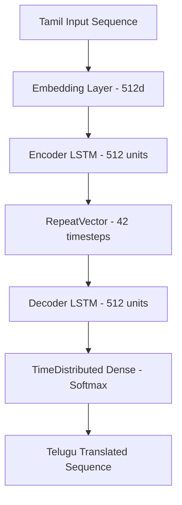

# Multilingual NLP Hub: Language Detection & Tamil-Telugu Machine Translation

[](https://www.python.org/)
[](https://tensorflow.org)
[](https://keras.io)
[](https://scikit-learn.org/)
[](LICENSE)

A structured collection of Natural Language Processing (NLP) projects demonstrating multilingual classification and neural machine translation (NMT) for South Indian languages (Dravidian family).

---

## 📂 Repository Structure

The project has been organized into a clean, modular structure:

```
nlpjcomp/
├── .gitignore               # Excludes python cache, checkpoints, and model weights
├── README.md                # Project documentation and guide
├── requirements.txt         # Package dependencies for local setup
├── data/                    # Dataset directory containing raw data and text corpuses
│   ├── file_name.csv        # Multi-class language identification dataset
│   ├── mkb.ta               # Parallel Tamil corpus (Mann Ki Baat speeches)
│   └── mkb.te               # Parallel Telugu corpus (Mann Ki Baat speeches)
└── notebooks/               # Interactive Jupyter notebooks for model development
    ├── NLPJcomp.ipynb       # Project 1: Language Detection models
    └── jcompv2.ipynb        # Project 2: Tamil-to-Telugu NMT model
```

---

## 🚀 Project 1: Multilingual Language Detection

An end-to-end classification pipeline to detect the language of a given text among four major Dravidian languages: **Kannada**, **Malayalam**, **Tamil**, and **Telugu**. 

### 📊 Dataset Details
The dataset (`data/file_name.csv`) consists of **2,032 text samples** distributed as follows:
*   **Telugu**: 600 samples
*   **Malayalam**: 594 samples
*   **Tamil**: 469 samples
*   **Kannada**: 369 samples

### 🧠 Model Performance & Accuracies
The pipeline cleans text by stripping symbols/numbers and converts strings using `CountVectorizer` (Bag of Words representation). The dataset is split into **70% Training / 30% Testing** and trained on three distinct ML architectures:

| Model | Classification Accuracy |
| :--- | :---: |
| **Multinomial Naive Bayes** | **99.18%** 🏆 |
| **Logistic Regression** | **93.44%** |
| **Support Vector Machine (SVM - Linear)** | **92.46%** |

> [!TIP]
> Multinomial Naive Bayes provides the best accuracy (99.18%) and fastest inference times for Dravidian language classification because of the distinct vocabulary sets between these languages when tokenized at the word level.

---

## 🛰️ Project 2: Tamil-to-Telugu Machine Translation

A sequence-to-sequence (Seq2Seq) neural machine translation model designed to translate text from Tamil (source) to Telugu (target). 

### 📈 Dataset & Corpus
*   **Corpus Source**: Parallel translation pairs of PM Narendra Modi's *Mann Ki Baat* radio speeches (`data/mkb.ta` and `data/mkb.te`).
*   **Vocabulary Details**: 
    *   Tamil Vocab Size: 13,339 words (Max length padded to 8 timesteps)
    *   Telugu Vocab Size: 13,300 words (Max length padded to 42 timesteps)

### 🏗️ Network Architecture
Built using Keras & TensorFlow, the Seq2Seq encoder-decoder architecture consists of:
1.  **Embedding Layer**: Map source words to dense 512-dimensional vector spaces.
2.  **Encoder LSTM**: Recurrent layer with 512 hidden units to encode the context.
3.  **RepeatVector**: Bridge between encoder output and decoder input.
4.  **Decoder LSTM**: Recurrent layer with 512 hidden units to generate translation sequences.
5.  **TimeDistributed Dense**: Softmax classification over the target Telugu vocabulary (13,300 categories).



*   **Optimizer**: `RMSprop` (Learning rate: 0.001)
*   **Loss Function**: `sparse_categorical_crossentropy`
*   **Training Configuration**: 30 Epochs, Batch Size of 512, 20% validation split.

---

## 🛠️ Setup & Installation

Follow these steps to set up and run the models locally:

### 1. Clone the Repository
```bash
git clone https://github.com/adarvens/nlpjcomp.git
cd nlpjcomp
```

### 2. Create a Virtual Environment
```bash
python3 -m venv venv
source venv/bin/activate  # On Windows: venv\Scripts\activate
```

### 3. Install Dependencies
```bash
pip install --upgrade pip
pip install -r requirements.txt
```

### 4. Launch Jupyter Notebook
```bash
jupyter notebook
```

> [!NOTE]
> The datasets are located in the `data/` directory. The notebooks are configured to automatically load data from their relative paths (e.g. `../data/file_name.csv`). If you run notebooks inside Google Colab, you can upload the `data/` folder to your Google Drive and specify the path.
